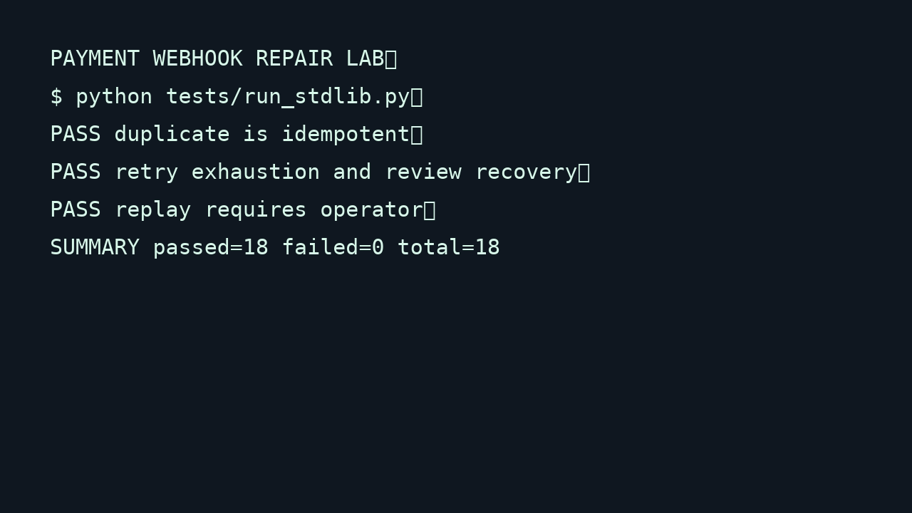

# Payment Webhook Repair Lab


## Business story
A synthetic payment endpoint demonstrates how duplicate delivery, invalid authentication, malformed data, provider failures, and partial storage failures can create payment and support risk.

## Before and after
Before: the handler trusts the body and writes directly to an order store. After: raw-body HMAC validation, strict schema checks, SQLite idempotency, explicit state transitions, bounded retries, review queue, audit timeline, and authorized replay are visible in one local demo.

## Architecture
Synthetic provider -> WSGI webhook API -> HMAC and schema validation -> SQLite event and order store -> state machine -> retry/review queue -> audit timeline.

## Setup
Python 3.10+ is sufficient. Pytest is optional for the runtime.

```sh
cd /a0/usr/workdir/freelance_os/projects/payment-webhook-repair-lab
python -m pytest -q
./scripts/reset_demo.sh
./scripts/emit_event.sh
./scripts/replay_event.sh evt_001
```

The scripts use the synthetic secret `sandbox-secret` and local operator token `demo-admin`. They do not call external providers. `demo.sqlite3` is local runtime state and should not be committed.

## API
`POST /webhooks/payment` accepts a signed JSON event. `POST /demo/replay/{event_id}` requires `Authorization: Bearer demo-admin`. `GET /demo/events/{event_id}` returns redacted event metadata and audit timeline. The API can be served by calling `src.api.serve(PaymentService(PaymentStore("demo.sqlite3")))` from a local Python process.

## Test evidence
The suite covers unit validation and state rules, HTTP integration, all nine specified failure scenarios, invalid signatures, payload limits, replay authorization, duplicate payload conflicts, and the complete local demo flow.

## MVP limits
No live payment provider, PCI handling, refunds, real messaging, production credentials, multi-region queue, Kubernetes, or reconciliation is included. Retry delays are deterministic demo delays.

## Client mapping
Idempotency prevents duplicate orders, the state machine blocks stale downgrades, the review queue makes failures visible, correlation IDs support investigation, and HMAC blocks unauthenticated event submission.

## Visual demo



[Open the short GIF demo](assets/demo.gif)

---

Maintained by Kiell Tampubolon. More selected work at [kielltampubolon.id](https://www.kielltampubolon.id/).
